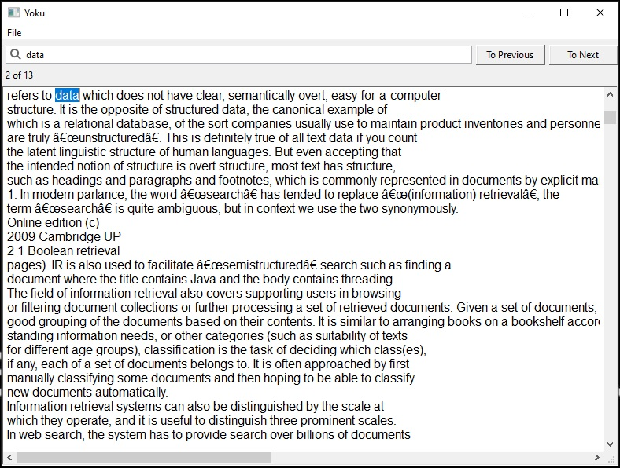
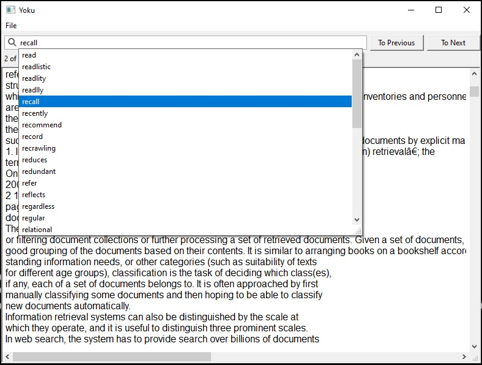

> My DSA semester project.
# Yoku Search Tool
## Introduction
Yoku search tool is an experimental file search tool. Like the one you see in a text editor upon pressing `ctrl + F`.
## Dependencies
Yoku search tool depends upon the [wxWidgets](https://github.com/wxWidgets/wxWidgets) library for its GUI. Do include it in your project prior to compilation.
## Screenshots
> Search

> Autocomplete

